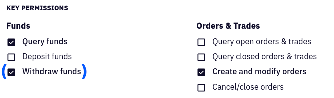

# Stacking Sats on Kraken

First off: Here's to you, [Bittr](https://getbittr.com/) – you will be missed! 😢

This script is not a full replacement for the incredible service Bittr offered, but it's a start:
Automate your Stacking Sats process by regularly placing buy orders using the [Kraken API](https://www.kraken.com/features/api).

Holding significant amounts on an exchange is never a good idea. You should regularly take ownership of your coins by withdrawing to your own wallet. This can either be done manually or it can be automated. The script provided here will only withdraw to a previously defined Bitcoin address if the relative fees do not exceed a certain limit.
*It is optional to run the witdrawal script.*

**Example 1**
- Max. relative fee: 0.5%
- Fixed Kraken fee: ₿ 0.00050
- Balance: ₿ 0.06000
- \> No withdrawal since fee actual (0.83%) is too high

**Example 2**
- Max. relative fee: 0.5%
- Fixed Kraken fee: ₿ 0.00050
- Balance: ₿ 0.12000
- \> Withdrawal executed since actual fee (0.42%) is low enough

## ✋ Caveat

You need to install the dependency [kraken-api](https://github.com/nothingisdead/npm-kraken-api), which is a third-party package.
It has a minimal set of dependencies and I've done my best to audit its code.
Also the version is fixed, so that unwanted ch<anges do not slip in.

However: Use this at your own risk and decide for yourself whether or not you want to run this script and its dependencies!

## 🔑 API Key

Obtain your Kraken API Key via [the API settings page](https://www.kraken.com/u/settings/api).
Generate a new API key dedicated for stacking using the "Query Funds" and "Modify Orders" permissions:



Only check the "Withdraw Funds" option if you plan to automatically withdraw Bitcoin from Kraken.

## 🔑 Withrawal method
In case you plan to automatically withdraw from Kraken, a withdrawal method must first be defined. If you already set up a methode you can reuse it. Otherwise generate a new one by going to **Funding** > **Bitcoin (XBT) withdraw** > **Add address**. The description field will later be used as an environment variable in the script.

## 📦 Setup

Prerequisite: At least the current LTS version of [Node.js](https://nodejs.org/).

Install the dependencies:

```sh
npm install
```

Setup the environment variables for the script:

```sh
# used to authenticate with Kraken
export KRAKEN_API_KEY="apiKeyFromTheKrakenSettings"
export KRAKEN_API_SECRET="privateKeyFromTheKrakenSettings"
# used only for buying
export KRAKEN_API_FIAT="USD" # the governmental shitcoin you are selling
export KRAKEN_BUY_AMOUNT=21 # fiat amount you trade for the future of money
# used only for withdrawing
export KRAKEN_MAX_REL_FEE=0.5 # maximum fee in % that you are willing to pay
export KRAKEN_WITHDRAW_KEY="descriptionOfWithdrawalAddress"
```

Use a dry run to test the script and see the output without placing an order:

```sh
npm test
```

You should see something like this sample output:

```text
💰 Balance: 210000.00 USD / 21.0 XBT

📈 Ask: 21000.2 USD
📉 Bid: 21000.1 USD

💸 Order: buy 0.21212121 XBTUSD @ limit 21000.1
📎 Transaction ID: 2121212121
```

To test the withdrawal of funds to your defined address run:
```sh
npm run test-withdraw-sats
```
You should see something like this:
```text
💡  Relative fee of withdrawal amount: 5.57%

❌ Don't withdraw now. Fee is too high. Max rel. fee: 0.50%

🚨  THIS WAS JUST A VALIDATION RUN, NO WITHDRAWAL HAS BEEN PLACED!

```

## 🤑 Stack sats

When you are good to go, execute this command in a regular interval:

```sh
npm run stack-sats
```

The best and easiest way is to wrap it all up in a shell script.
This script can be triggered via cron job, e.g. weekly, daily or hourly.

Here's a sample `stack-sats.sh` script:

```sh
#!/bin/bash
set -e

# hide deprecation warning
export NODE_OPTIONS="--no-deprecation"

export KRAKEN_API_KEY="apiKeyFromTheKrakenSettings"
export KRAKEN_API_SECRET="privateKeyFromTheKrakenSettings"
export KRAKEN_API_FIAT="USD"
export KRAKEN_BUY_AMOUNT=21

BASE_DIR=$(cd `dirname $0` && pwd)
cd $BASE_DIR/stacking-sats-kraken
result=$(npm run stack-sats 2>&1)
echo $result

# Optional: Send yourself an email
recipient="satstacker@example.org"
echo "Subject: Sats got stacked
From: satstacker@example.org
To: $recipient $result" | /usr/sbin/sendmail $recipient
```

Make it executable with `chmod +x stack-sats.sh` and go wild.

[Stay humble!](https://twitter.com/matt_odell/status/1117222441867194374) 🙏

## 🔑 Withraw sats

It is recommended to run the withdrawal script every time you stacked sats:

```sh
npm run withdraw-sats
```
Since it can take a couple seconds or minutes for your order to fill, you should run the following script maybe a couple hours later after your `stack-sats` script ran. Just set up a second cron job which executes the following script.

Here's a sample `withdraw-sats.sh` script:

```sh
#!/bin/bash
set -e

# hide deprecation warning
export NODE_OPTIONS="--no-deprecation"

export KRAKEN_API_KEY="apiKeyFromTheKrakenSettings"
export KRAKEN_API_SECRET="privateKeyFromTheKrakenSettings"
export KRAKEN_MAX_REL_FEE=0.5
export KRAKEN_WITHDRAW_KEY="descriptionOfWithdrawalAddress"

BASE_DIR=$(cd `dirname $0` && pwd)
cd $BASE_DIR/stacking-sats-kraken
result=$(npm run withdraw-sats 2>&1)
echo $result
```

Make it executable with `chmod +x withdraw-sats.sh` and add it to your cron schedule.

## ⚡️ RaspiBlitz Integration

This script ships with the [RaspiBlitz](https://github.com/rootzoll/raspiblitz) (v1.6 and above).

You can enable it via the Console of your RaspiBlitz.
Leave the main menu via the last option "Console" and use the following commands:

```sh
# enable the script
./config.scripts/bonus.stacking-sats-kraken.sh on

# switch to the stackingsats user
sudo su - stackingsats

# edit your configuration (see "Setup" above)
nano /mnt/hdd/app-data/stacking-sats-kraken/.env

# follow the instructions from the first step to set up a cronjob
crontab -e
```

Here is an example for a daily cronjob at 6:15am ...

```sh
SHELL=/bin/bash
PATH=/bin:/usr/sbin:/usr/bin:/usr/local/bin
15 6 * * * /home/stackingsats/stacksats.sh > /dev/null 2>&1
```
